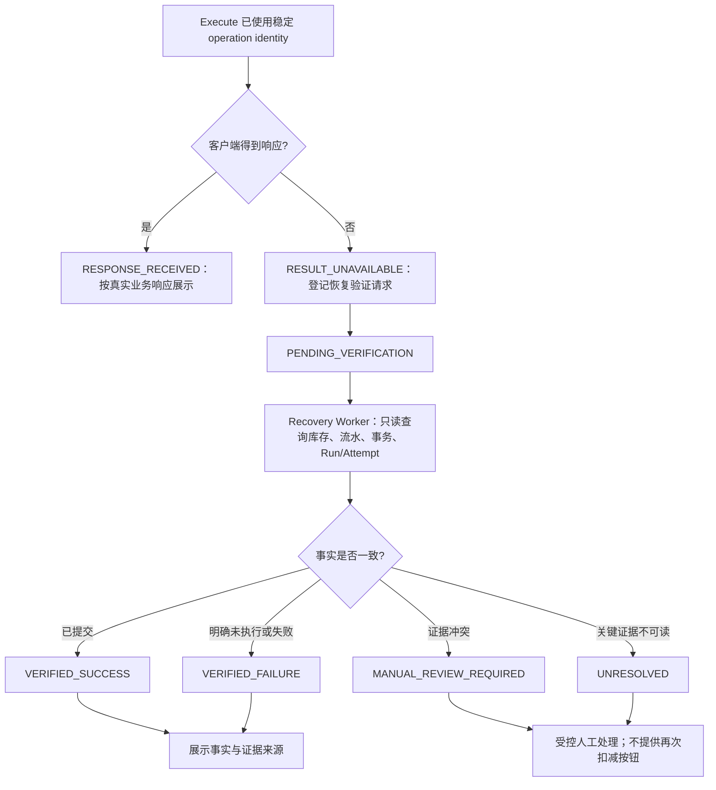

# Material Issue UNKNOWN Recovery Runtime Design

**设计状态：DESIGN ONLY**
**范围：Phase C-4 架构调查与设计；本文件不实现业务、API、数据库、UI 或测试能力。**

## 1. 真实问题来源

Scenario E 的浏览器验收已记录在 `docs/MATERIAL_ISSUE_SCENARIO_E_ACCEPTANCE.md`，其结论仍为 **NOT VERIFIED**。真实验收中，客户端在 Execute 请求发出后中止，因而未获得可用响应；随后人工读取同一业务事实时发现：库存已扣减、存在一条 `INVENTORY_ISSUE` 流水、申请和业务事务均为 `COMMITTED`，运行轨迹为执行成功且验证通过。

这证明当前系统能由普通详情回读发现已提交事实，但它**没有**形成下列受治理闭环：

- 服务端持久记录客户端的 `RESULT_UNAVAILABLE` 观察事实；
- 自动或受控地创建面向该领料操作的恢复验证任务；
- 由只读事实验证器给出可审计结论；
- 以恢复治理状态向用户呈现 `VERIFIED_SUCCESS`、`VERIFIED_FAILURE`、`MANUAL_REVIEW_REQUIRED` 或 `UNRESOLVED`。

因此，普通详情回读不是 Recovery Runtime；本设计文件也不会改变 Scenario E 的验收结论。

## 2. 当前实现调查（代码与 Schema 证据）

### 2.1 Material Issue 的真实执行链路

| 事实 | 代码 / 表证据 | 当前结论 |
|---|---|---|
| 认证身份与企业边界 | `controllers/transactionSafetyController.js` 使用 `req.user.id`、`req.user.enterprise_id`、`req.user.role`；`routes/transactionSafetyRoutes.js` 对路由使用 `authRequired` | API 从已认证上下文取得企业与用户身份。 |
| 稳定业务操作身份 | `services/transactionSafetyService.js` 的 `prepare()` / `operation()`；`business_operations.business_operation_id`、`enterprise_id`、`current_transaction_id`、`final_status` | 同企业、同操作标识可查询既有操作；已提交操作返回历史结果。 |
| 准备与审批 | `transaction_preparations`、`material_requisitions`、`material_reservations`、`business_transactions`；`prepare()` | 审批前保存准备快照、版本、TTL 与软预约，未持有长期 SQLite 事务。 |
| 最终执行 | `transactionSafetyService.execute()`；`repositories/inventoryRepository.js` 的 `conditionalDeduct()`、`appendStockTransaction()` | 短业务事务内重验版本和库存，再扣库存、写流水并更新申请/事务。 |
| 业务事实 | `inventory`、`stock_transactions`、`material_requisitions`、`business_transactions`、`business_operations` | 库存余额、库存流水及业务事务是领料结果的主要事实来源。 |
| Runtime Trace | `runtime_runs`、`runtime_steps`、`runtime_attempts`、`runtime_validations`；`services/transactionAuditService.js` | 审计写入与库存业务事务隔离，业务回滚不能吞掉失败 Trace。 |
| 通用 Recovery | `services/auditRecoveryService.js`；`audit_recovery_jobs`、`audit_recovery_attempts` | 已有持久化、Claim、Lease、幂等、Situation Check 与通用验证框架；当前默认 Handler 不是 Material Issue 事实验证器。 |

### 2.2 当前状态集合与边界

`services/transactionSafetyService.js` 的真实业务/事务状态包括：

`PREPARING`、`VALIDATING`、`WAITING_APPROVAL`、`APPROVED`、`EXECUTING`、`COMMITTED`、`ISSUED`、`REJECTED`、`ROLLED_BACK`、`CONCURRENCY_ABORT`、`FAILED`、`EXPIRED`、`UNKNOWN`。

其中当前 `UNKNOWN` 已是 Transaction Safety 状态机中的终态候选，但当前 `execute()` 路径并不会因为浏览器客户端失去响应而写入该状态。不能把“客户端未收到响应”直接当作业务事务失败或已提交。

`services/runtimeObservabilityService.js` 的验证状态包含 `UNKNOWN`，但该能力目前是运行观测状态枚举，非 Material Issue 客户端未知结果的完整治理闭环。

`services/auditRecoveryService.js` 的 Recovery Job 状态包括 `PENDING_RETRY`、`CLAIMED`、`RUNNING`、`SUCCEEDED`、`RETRY_SCHEDULED`、`DEAD`、`CANCELLED`、`UNKNOWN`。这是恢复作业状态，不能替代库存业务事实。

## 3. 三层状态模型

### 3.1 客户端观察状态（未来登记，不是业务终态）

| 状态 | 含义 | 当前是否持久化 |
|---|---|---|
| `RESPONSE_RECEIVED` | 客户端收到 Execute 的明确 HTTP 响应。 | 没有专门登记。 |
| `RESULT_UNAVAILABLE` | 请求可能已到达服务端，但客户端因断开、超时或中止而无法确认结果。 | 没有专门登记。 |

`RESULT_UNAVAILABLE` 只表达观察不确定性，绝不等于 `FAILED`、`COMMITTED` 或“允许重试”。

### 3.2 恢复治理状态（C-4 后续候选）

| 状态 | 含义 | 是否等于业务事实 |
|---|---|---|
| `PENDING_VERIFICATION` | 已登记未知观察，等待只读事实验证。 | 否 |
| `VERIFYING` | Recovery Worker 正在读取证据。 | 否 |
| `VERIFIED_SUCCESS` | 多项事实一致地证明已执行并提交。 | 否；映射到业务 `COMMITTED` 证据。 |
| `VERIFIED_FAILURE` | 多项事实一致地证明未执行或明确失败。 | 否；映射到业务失败证据。 |
| `MANUAL_REVIEW_REQUIRED` | 证据冲突或高风险，必须由人处理。 | 否 |
| `UNRESOLVED` | 关键事实不可读或不足，不能下结论。 | 否 |

### 3.3 真实业务状态

业务层继续以现有 `material_requisitions.status`、`business_transactions.status`、`business_operations.final_status`、`transaction_preparations.status` 及库存流水为准。例如 `WAITING_APPROVAL`、`APPROVED`、`COMMITTED`、`FAILED`、`REJECTED`、`EXPIRED`、`CONCURRENCY_ABORT`。

治理层只能解释证据，不能覆盖业务层状态。尤其不能把客户端 `RESULT_UNAVAILABLE` 写成业务事务最终 `UNKNOWN`。

## 4. 现有结构映射与缺口

| 设计概念 | 现有实现 | 可直接复用 | 缺口 | 后续建议 |
|---|---|---|---|---|
| Operation identity | `business_operations` 的 `enterprise_id` + `business_operation_id`，并关联 `current_transaction_id` | 是 | Execute API 未单独保存客户端观察事件 | C-4.1 在请求边界登记稳定身份与客户端观察。 |
| 真实库存结果 | `inventory.stock_quantity`、`version` | 是 | 余额本身不能单独证明本次操作 | 与事务/流水/操作 ID 联合验证。 |
| 事实流水 | `stock_transactions`，含 `business_operation_id`、`transaction_id`、前后库存 | 是 | 无 | C-4.2 以只读方式查询。 |
| 申请与事务事实 | `material_requisitions`、`business_transactions`、`transaction_preparations` | 是 | 多表结果可能冲突，缺少统一分类器 | C-4.2 增加只读事实验证器。 |
| Runtime 证据 | `runtime_runs`、`runtime_attempts`、`runtime_validations` | 是 | 不会自动关联客户端观察未知事件 | 在 Recovery payload 中携带 run / attempt 关联。 |
| Evidence Provenance | 未发现名为 Evidence Provenance 的独立表或服务；现有 `runtime_validations.input_snapshot`、`validation_source`、`validation_result`、`audit_recovery_attempts.situation_state` 与 `audit_recovery_events.detail` 可保存来源化证据 | 部分 | 没有统一的 Material Issue 证据包模型 | 初期使用结构化 Validation/Recovery payload；后续再评估是否需要专用模型。 |
| Recovery Job | `audit_recovery_jobs`、`audit_recovery_attempts`、幂等、Claim、Lease、审计事件 | 是 | 当前 Handler 不读取 Material Issue 的库存、流水和事务事实 | C-4.3 增加只读 Material Issue 验证 Handler。 |
| 人工处理 | 现有审批/运行 Trace 结构 | 部分 | 没有 UNKNOWN 事实冲突处理界面 | C-4.4 设计受限人工处理界面。 |

## 5. 事实验证矩阵

验证器必须以 `enterprise_id`、`business_operation_id`、`transaction_id` / `preparation_id` 为范围读取事实；不能仅使用 HTTP 状态或页面文字。

| 库存变化 | `INVENTORY_ISSUE` | Business Transaction | Run / Attempt | 结论 |
|---|---|---|---|---|
| 已变化，且流水中的 `stock_before` / `stock_after` 与库存及版本一致 | 恰好 1 条，关联同一操作/事务 | `COMMITTED` | 有执行证据 | `VERIFIED_SUCCESS` |
| 未变化 | 0 条 | 明确 `FAILED`、`REJECTED`、`EXPIRED` 或不可执行终态 | 有失败/阻断证据 | `VERIFIED_FAILURE` |
| 余额、流水、事务或 Trace 相互矛盾 | 不确定或冲突 | 不确定 / 冲突 | 有 Attempt | `MANUAL_REVIEW_REQUIRED` |
| 关键表不可读、租户边界无法确认或关键关联缺失 | 未知 | 未知 | 有 Attempt 或未知观察记录 | `UNRESOLVED` |

附加安全规则：

- 找到多条同一 `transaction_id` 的库存流水属于数据完整性异常，应进入 `MANUAL_REVIEW_REQUIRED`，不是成功。
- 有 `COMMITTED` 事务但没有同操作库存流水，属于证据矛盾。
- 有库存变化而无法用对应操作/事务流水解释，不能把变化归因给该 Execute。
- 所有只读验证都必须带 `enterprise_id`，避免跨企业证据混入。

## 6. 受治理 UNKNOWN 恢复流程（设计）

设计顺序：

1. Execute 在现有 `business_operation_id`、`transaction_id`、`preparation_id` 基础上建立可回读的稳定身份。
2. 客户端未获得响应时，仅登记 `RESULT_UNAVAILABLE`；不得写业务成功或失败。
3. 创建或触发现有 `audit_recovery_jobs` 中的专用、只读验证作业。
4. Worker 查询库存、`stock_transactions`、`material_requisitions`、`business_transactions`、`business_operations` 与 Runtime Trace。
5. Validator 输出结构化事实、来源、读取时间与分类结果。
6. 仅分类为 `VERIFIED_SUCCESS`、`VERIFIED_FAILURE`、`MANUAL_REVIEW_REQUIRED`、`UNRESOLVED`。
7. 不经事实验证，禁止重放 Execute、创建第二条库存流水或第二次扣库存。

## 7. 幂等与重复执行防护

当前可复用的防护已经包括：

- `business_operations` 对企业、操作类型和 `business_operation_id` 的活跃唯一约束；
- 已 `COMMITTED` 的同操作返回历史结果，而不是再次扣库存；
- `stock_transactions` 的 `transaction_id` 唯一索引；
- `inventory.version` 的乐观锁与最终库存/安全库存条件；
- `execute()` 对非可执行 Preparation 返回 HTTP 409；
- Scenario E 的真实后续读取表明，重复 Execute 返回 HTTP 409，且不增加库存流水或再次扣减库存。

UNKNOWN 恢复期间必须继续使用原 `business_operation_id`、原事务引用和原幂等关联。验证任务是读事实，不是新业务执行。只有未来人工明确确认“从未执行”且重新进行完整 Preparation/Approval 时，才能**提出**新的执行建议；本设计不授权自动重试。

## 8. 人工介入边界与最小 UI 设计

`MANUAL_REVIEW_REQUIRED` 和 `UNRESOLVED` 的最小人工页面应只展示可验证事实：

- 原领料申请与 `enterprise_id`；
- `business_operation_id`、`transaction_id`、`preparation_id`、原幂等键；
- 首次 Execute 时间以及客户端中止/超时观察；
- Run、Step、Attempt、Validation 记录；
- `inventory.stock_quantity` 与 `version` 的前后事实；
- `INVENTORY_ISSUE` 流水数量与关联 ID；
- Business Transaction、Requisition、Operation 的当前状态；
- 证据冲突、不可读证据和验证器建议；
- 审批/处理人、理由、时间与审计事件。

该页面不得提供“再扣一次库存”或隐式重放 Execute 的按钮。人工可做的后续动作应被限定为阅读、确认事实、请求新的正规流程，或按未来另行审批的补救流程处理。

## 9. API 与数据模型候选（均未实现）

### 9.1 不改 Schema 的最小候选

优先复用 `audit_recovery_jobs`：

- `handler_type`：候选 `material_issue_fact_verification`；
- `idempotency_key`：由企业、业务操作与原事务标识组成；
- `payload`：仅保存 `enterprise_id`、`business_operation_id`、`transaction_id`、`preparation_id`、客户端观察时间和关联 Run/Attempt；
- `audit_recovery_attempts.situation_state`：保存每次只读事实快照与 fingerprint；
- `runtime_validations`：保存结构化验证结果、来源和失败/冲突原因。

该方案的前提是 C-4.1 在服务端或受控调用方能够可靠登记 `RESULT_UNAVAILABLE`。仅靠已经断开的浏览器不能保证登记成功，这是当前真实缺口。

### 9.2 API 候选

以下都是后续候选，不是现有 API：

| 候选 | 目的 | 安全边界 |
|---|---|---|
| 创建未知结果验证请求 | 只登记客户端观察并关联已有 Operation/Transaction | 不执行库存操作；必须认证、企业隔离、幂等。 |
| 查询未知结果验证详情 | 返回验证结论和证据摘要 | 只读；隐藏不必要敏感快照。 |
| 管理员请求人工复核 | 将冲突/不可读结果交给受权人员 | 不能直接重新 Execute。 |

### 9.3 Schema 候选

当前不建议在 C-4 设计阶段直接新增表。现有 Recovery Job payload 加 `runtime_validations` 可以形成最小闭环。

若后续实施证实必须将“客户端观察事件”与业务操作做长期、强查询关联，才候选评估独立观察记录或受控关联字段。该决定必须先验证：现有 `audit_recovery_jobs` 的 payload、幂等键、审计历史和查询性能是否足够。任何迁移都不得倒推或伪造历史 UNKNOWN 记录。

## 10. 现有能力、真实缺口与风险

### 可直接复用

- 企业隔离、认证上下文、操作 ID 和 Preparation/Transaction 引用；
- 真实库存余额、版本、库存流水和业务事务事实；
- Runtime Run/Attempt/Validation 审计；
- Audit Recovery 的持久作业、Claim、Lease、幂等、Situation Check、Attempt 历史和人工重试权限；
- 后续详情/API 回读已提交业务事实的能力。

### 真实缺口

- 没有持久化 `RESULT_UNAVAILABLE` 客户端观察事件；
- 没有 Material Issue 专用的只读事实验证 Handler；
- `audit_recovery_jobs` 当前不会由 Material Issue Execute 自动创建；
- 没有将恢复验证结论投射为上述治理状态的 UI/API；
- 没有专用、统一的 Evidence Provenance 表/服务；现有字段只能承载结构化来源化证据；
- 当前通用 Recovery Worker 不理解 Material Issue 业务事实，不能声称具备自动领料 UNKNOWN 恢复。

### 风险与未决问题

- 服务器已成功提交但客户端未收到响应时，客户端本身不一定能安全发送第二个“未知结果”登记请求；需要 C-4.1 定义服务端时序与断线检测边界。
- SQLite 单库中的事实读取需要定义一致读取边界与证据采样时间，避免把不同时间点的事实误判为冲突。
- `VERIFIED_FAILURE` 不等于允许自动重试；是否可以重新发起必须仍经过完整的权限、Preparation、审批与业务规则。
- 证据冲突、高风险覆盖、跨系统副作用或缺失流水必须人工处理，不能由 Recovery Worker 猜测补偿。

## 11. 后续实施拆分（仅提案）

| 阶段 | 范围 | 可独立验证 / 回滚点 |
|---|---|---|
| C-4.1 | 稳定操作身份与未知结果登记 | 验证只登记观察，不改库存；可移除触发点且不影响既有 Execute。 |
| C-4.2 | 只读 Material Issue 事实验证器 | 用隔离 SQLite Fixture 对四类矩阵结果验证；无写库存能力。 |
| C-4.3 | 接入现有 Recovery Job | 验证 Job、Claim、Attempt、Validation 与幂等；可关闭 Handler 注册。 |
| C-4.4 | 人工处理界面 | 验证只读证据和受控人工流转；没有再扣库存操作。 |
| C-4.5 | Scenario E 重新验收 | UI、API、SQLite 三类证据共同决定验收结论。 |

## 12. 明确非目标

本设计不实现也不授权：

- 自动重试领料 Execute；
- 自动补偿、回滚或二次扣减库存；
- 修改 Material Issue、Inventory、Approval、Recovery Runtime 的当前业务语义；
- 新业务主数据、ERP/MES/WMS 连接、Agent 自动执行；
- 通过浏览器页面或 HTTP 状态猜测业务事实；
- 将 Scenario E 从 `NOT VERIFIED` 改为通过。

## 13. 结论

当前系统已具备可靠的业务幂等、库存事务事实与通用恢复治理构件，但尚未有“客户端结果未知 → 只读事实验证 → 受治理结论”的 Material Issue 闭环。最小安全路径是优先复用现有 Recovery Job、Runtime Validation 和业务事实表，实现只读验证；在没有多项一致事实之前，禁止再次执行库存扣减。
